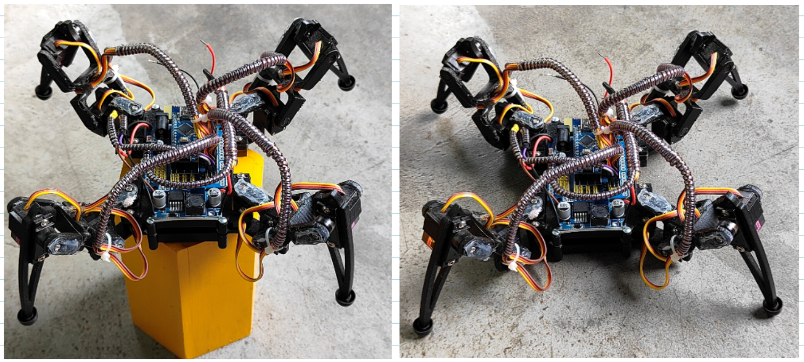
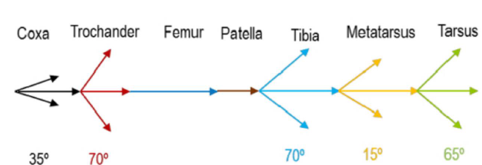
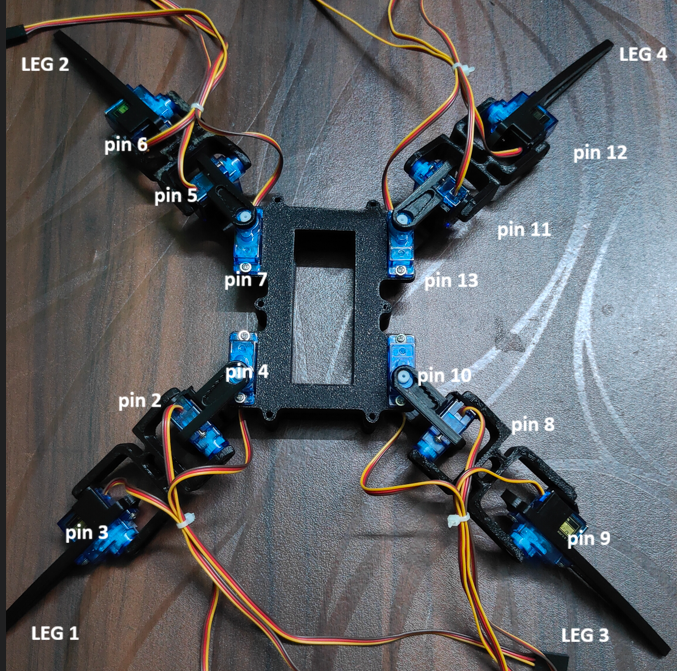
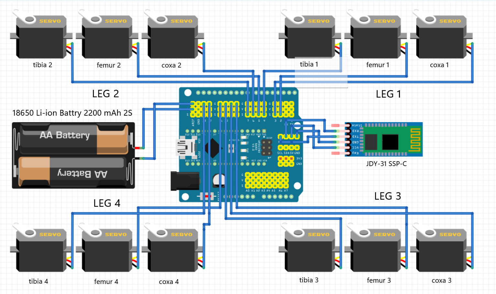

# 🤖 Q_BEE_V6 Quadruped Robot

<p align="center">
  <b>A feature-rich, Arduino-powered quadruped robot with inverse kinematics, smooth gaits, and modular code.</b><br>
  <i>Inspired by <a href="https://www.instructables.com/DIY-Arduino-Quadruped-Robot-With-Inverse-Kinematic/">DIY Arduino Quadruped Robot With Inverse Kinematic</a> by ilhamdefra.</i>
</p>

<div align="center">
  
  
</div>

---

## 🖼️ Final Model

Here is the rendered model of the Q_BEE_V6 quadruped robot:

<p align="center">
  
</p>

---

## 📁 Project Structure

| File/Folder           | Purpose                                      |
|----------------------|----------------------------------------------|
| `Q_BEE_V6.ino`       | Main Arduino sketch and entry point           |
| `Q_BEE_V6_defs.h`    | Robot geometry, constants, helpers            |
| `Q_BEE_V6_kinematics.h` | Inverse kinematic math (cartesian↔polar)   |
| `Q_BEE_V6_motion.*`  | High-level motion primitives/utilities        |
| `Q_BEE_V6_moves.*`   | Gait sequences, gestures, body motions        |
| `Q_BEE_V6_servo.*`   | Servo abstraction and interpolation service   |
| `Q_BEE_V6_state.h`   | Global state shared across modules            |
| `3D Parts/`          | STL/GLB files for 3D-printed parts           |
| `Diagrams/`          | Circuit, kinematics, and assembly diagrams    |


## 🛠 Hardware and 3D Printed Parts

The robot uses twelve 9 g hobby servos (TowerPro SG90 or equivalent) arranged as:

| Leg | Coxa | Femur | Tibia |
|-----|------|-------|-------|
| Front left  | pin 2 | pin 3 | pin 4 |
| Rear left   | pin 5 | pin 6 | pin 7 |
| Front right | pin 8 | pin 9 | pin 10 |
| Rear right  | pin 11| pin 12| pin 13 |

A standard Arduino UNO powers the system; a sensor shield or servo shield makes wiring convenient (see *Electrical Component Connection* in the original Instructables article).

3D‑printed parts for the chassis and legs are stored in `3D Parts/`:

- `body-d.stl`, `body-m.stl`, `body-u.stl` – body sections
- `coxa-b.stl`, `coxa-f.stl` – coxa joints
- `femur.stl`, `tibia-b.stl`, `tibia-f.stl` – femur and tibia segments
- `hinge.stl` – generic hinge part

### 🧩 Parts List

| Part      | Quantity |
|-----------|----------|
| tibia‑f   | 2        |
| tibia‑b   | 2        |
| coxa‑f    | 2        |
| coxa‑b    | 2        |
| femur     | 4        |
| hinge     | 8        |
| body‑u    | 1        |
| body‑m    | 1        |
| body‑d    | 1        |


As shown below, the geometry definitions in `Q_BEE_V5_defs.h` (length_a, length_b, length_c) correspond to the link lengths of the printed legs.



## � Circuit Diagrams & Connections

For ease of assembly, the following diagrams show the Arduino/sensor shield wiring and the overall electrical layout:

<table><tr>
<td></td>
<td></td>
</tr></table>

Use these as a reference when wiring the servos and power supply to the UNO and any sensor/communication modules.


## 📐 Kinematics Section

This section explains the code for the inverse kinematics used in the quadruped robot. The main function is `cartesian_to_polar`, which converts a desired foot position `(x, y, z)` into the three joint angles `(alpha, beta, gamma)` for each leg:

```cpp
static inline void cartesian_to_polar(float &alpha, float &beta, float &gamma, float x, float y, float z) {
  float v, w;
  w = (x >= 0 ? 1.0f : -1.0f) * (sqrt(x * x + y * y));
  v = w - length_c;
  float denom = 2.0f * length_a * sqrt(v * v + z * z);
  float aarg;
  if (denom < EPSILON) aarg = 1.0f; else aarg = (length_a * length_a - length_b * length_b + v * v + z * z) / denom;
  aarg = clampf(aarg, -1.0f, 1.0f);
  alpha = atan2(z, v) + acos(aarg);
  float barg = (length_a * length_a + length_b * length_b - v * v - z * z) / (2.0f * length_a * length_b);
  barg = clampf(barg, -1.0f, 1.0f);
  beta = acos(barg);
  gamma = (w >= 0) ? atan2(y, x) : atan2(-y, -x);
  // convert to degrees
  alpha = alpha / pi * 180.0f;
  beta = beta / pi * 180.0f;
  gamma = gamma / pi * 180.0f;
}
```

**Explanation:**

- `w` is the horizontal distance from the robot's center to the foot, signed by the x direction.
- `v` is the effective reach after subtracting the coxa length (`length_c`).
- The femur angle `alpha` is calculated using `atan2` and the law of cosines, with clamping to avoid domain errors.
- The tibia angle `beta` is also calculated using the law of cosines and clamped.
- The coxa rotation `gamma` is the azimuth angle in the horizontal plane.
- All angles are converted to degrees for servo compatibility.

This function allows the robot to move its legs to any reachable position in 3D space by solving the inverse kinematics for each leg.

## 🔧 Build & Upload Instructions

1. **Hardware assembly** – Follow the Instructables guide or adapt your own chassis.  Ensure all servos are mounted and wired according to the pin mapping above.
2. **Install Arduino IDE** – download from [arduino.cc/software](https://www.arduino.cc/en/software/).
3. **Open the project** – load `Q_BEE_V6.ino` into the IDE.
4. **Configure SERVO ranges** – adjust `SERVO_MIN_US`/`MAX_US` in the sketch if your servos differ.
5. **Upload** – connect the UNO via USB and upload the sketch.
6. **Power** – use a capable 5 V supply (phone charger, battery pack) to drive the servos when not connected to USB.

> **Tip:** sit/stand positions and gait parameters can be tuned by editing the constants defined in the `.ino` file (e.g. `z_default`, `move_speed`).

## 🧠 Software Overview

- **Inverse Kinematics** (`Q_BEE_V5_kinematics.h`) converts target foot coordinates `(x,y,z)` into joint angles `α,β,γ`, then into servo angles depending on leg orientation.
- **Motion primitives** (`set_site`, `wait_reach`, etc.) manage cartesian interpolation and maintain `site_now`/`site_expect` state.
- **Gaits & gestures** (`Q_BEE_V5_moves.cpp`) implement walking, turning, waving, dancing, etc.
- **Servo service** (`Q_BEE_V5_servo.cpp`) runs on a `FlexiTimer2` interrupt every 10 ms, performing quintic interpolation for smooth motion and updating the hardware.

The demo loop in `Q_BEE_V5.ino` showcases each capability sequentially; you can replace it with sensor input or remote commands to build autonomous behavior.


## 📚 References

- Original Instructables article: [DIY Arduino Quadruped Robot With Inverse Kinematic](https://www.instructables.com/DIY-Arduino-Quadruped-Robot-With-Inverse-Kinematic/)

Feel free to experiment, modify the gait parameters, or adapt the kinematics for different leg geometries. Happy coding! 🐾