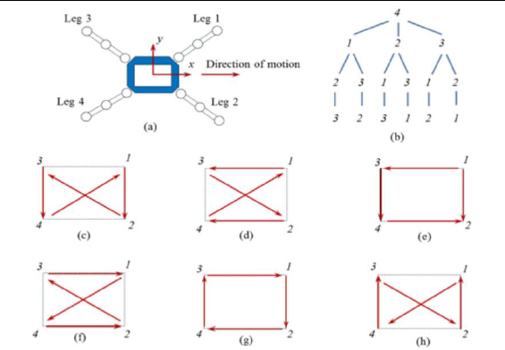
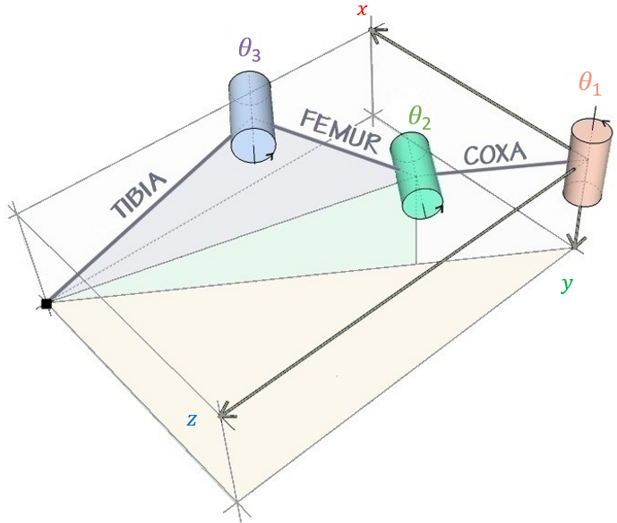
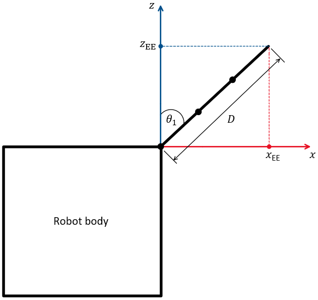
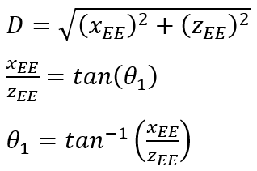
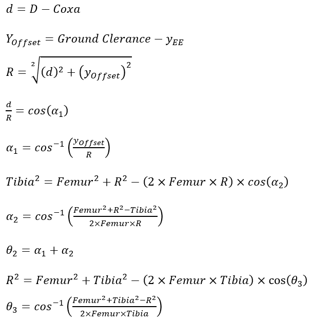

# Q_BEE_V5 Quadruped Robot

This repository contains the source code, geometry, and documentation for the **Q_BEE_V5** Arduino‑based quadruped robot.  The project is heavily inspired by the Instructables project *"DIY Arduino Quadruped Robot With Inverse Kinematic"* by ilhamdefra and implements inverse‑kinematics, smooth leg interpolation, and a simple demo gait using 12 SG90 servos.



---

## 📁 Repository Structure

- `Q_BEE_V5.ino` – main Arduino sketch and entry point
- `Q_BEE_V5_defs.h` – robot geometry, constants and helpers
- `Q_BEE_V5_kinematics.h` – inverse kinematic math (cartesian↔polar)
- `Q_BEE_V5_motion.*` – high‑level motion primitives and utilities
- `Q_BEE_V5_moves.*` – gait sequences, gestures, and body motions
- `Q_BEE_V5_servo.*` – servo abstraction and interpolation service
- `Q_BEE_V5_state.h` – global state shared across modules


## 🛠 Hardware and 3D Printed Parts

The robot uses twelve 9 g hobby servos (TowerPro SG90 or equivalent) arranged as:

| Leg | Coxa | Femur | Tibia |
|-----|------|-------|-------|
| Front left  | pin 2 | pin 3 | pin 4 |
| Rear left   | pin 5 | pin 6 | pin 7 |
| Front right | pin 8 | pin 9 | pin 10 |
| Rear right  | pin 11| pin 12| pin 13 |

A standard Arduino UNO powers the system; a sensor shield or servo shield makes wiring convenient (see *Electrical Component Connection* in the original Instructables article).

3D‑printed parts for the chassis and legs are stored in `3D Parts/`:

- `body-d.stl`, `body-m.stl`, `body-u.stl` – body sections
- `coxa-b.stl`, `coxa-f.stl` – coxa joints
- `femur.stl`, `tibia-b.stl`, `tibia-f.stl` – femur and tibia segments
- `hinge.stl` – generic hinge part

### 🧩 Parts List

| Part      | Quantity |
|-----------|----------|
| tibia‑f   | 2        |
| tibia‑b   | 2        |
| coxa‑f    | 2        |
| coxa‑b    | 2        |
| femur     | 4        |
| hinge     | 8        |
| body‑u    | 1        |
| body‑m    | 1        |
| body‑d    | 1        |


As shown below, the geometry definitions in `Q_BEE_V5_defs.h` (length_a, length_b, length_c) correspond to the link lengths of the printed legs.


## 📐 Kinematics and Diagrams

The `Diagrams/` folder contains reference illustrations used during development:

- `IK1.png` … `IK5.png` – inverse‑kinematics derivation and coordinate frames
- `Coordinate frames of the robot.png` – body/leg coordinate axes
- `Quadruped walk.png` – gait sequence overview
- `Simulator models.png` – model visuals used for simulation

These images may be referenced directly from the README as shown above.

## 🔧 Build & Upload Instructions

1. **Hardware assembly** – Follow the Instructables guide or adapt your own chassis.  Ensure all servos are mounted and wired according to the pin mapping above.
2. **Install Arduino IDE** – download from [arduino.cc/software](https://www.arduino.cc/en/software/).
3. **Open the project** – load `Q_BEE_V5.ino` into the IDE.
4. **Configure SERVO ranges** – adjust `SERVO_MIN_US`/`MAX_US` in the sketch if your servos differ.
5. **Upload** – connect the UNO via USB and upload the sketch.
6. **Power** – use a capable 5 V supply (phone charger, battery pack) to drive the servos when not connected to USB.

> **Tip:** sit/stand positions and gait parameters can be tuned by editing the constants defined in the `.ino` file (e.g. `z_default`, `move_speed`).

## 🧠 Software Overview

- **Inverse Kinematics** (`Q_BEE_V5_kinematics.h`) converts target foot coordinates `(x,y,z)` into joint angles `α,β,γ`, then into servo angles depending on leg orientation.
- **Motion primitives** (`set_site`, `wait_reach`, etc.) manage cartesian interpolation and maintain `site_now`/`site_expect` state.
- **Gaits & gestures** (`Q_BEE_V5_moves.cpp`) implement walking, turning, waving, dancing, etc.
- **Servo service** (`Q_BEE_V5_servo.cpp`) runs on a `FlexiTimer2` interrupt every 10 ms, performing quintic interpolation for smooth motion and updating the hardware.

The demo loop in `Q_BEE_V5.ino` showcases each capability sequentially; you can replace it with sensor input or remote commands to build autonomous behavior.

---

## 📘 Function Reference

### Inverse Kinematics (`Q_BEE_V5_kinematics.h`)

The `cartesian_to_polar` routine solves the classic 3‑joint leg inverse kinematics.  Given a desired foot tip position `(x,y,z)` relative to the coxa joint, it computes three angles:

- **α**: elevation of the femur joint
- **β**: bend of the tibia joint
- **γ**: rotation of the coxa joint in the horizontal plane

```cpp
static inline void cartesian_to_polar(float &alpha, float &beta, float &gamma,
                                     float x, float y, float z)
```

The math is split into two 2‑D problems (see diagrams below):

1. Top view (x‑z plane) defines `γ` and the effective leg span `w = ±√(x²+y²)`.
2. Side view (v‑z plane, where `v = w - length_c`) uses the law of cosines to
   compute α and β based on link lengths `length_a`, `length_b`.

<blockquote>See the sequences below for step‑by‑step derivations.</blockquote>

|  |  |  |

|  |  |

The computed angles are converted to degrees and clamped to `[-1,1]` where
acos/asin arguments appear to avoid numeric errors.

The companion function `polar_to_servo_angles` applies leg‑specific
transformations and bounds the results to `[0,180]` for use with hobby servos.

### Motion primitives (`Q_BEE_V5_motion.*`)

- `set_site(int leg, float x, float y, float z)`
  - Plans a motion for a single leg.  Accepts `KEEP` (255) for any axis to leave
    that coordinate unchanged.
  - Computes the linear cartesian velocity `temp_speed` and the number of
    interpolation ticks based on `move_speed` and `speed_multiple`.
  - Converts the final cartesian target into servo angles and stores both
    interpolation metadata and per‑tick servo deltas (`servo_step`, etc.).

- `wait_reach(int leg)` / `wait_all_reach()`
  - Blocks until the requested leg(s) reach their expected cartesian positions
    within a 0.1 unit tolerance.  These are used heavily by the gaits to force
    synchronized phase changes.

### Servo management (`Q_BEE_V5_servo.*`)

- `servo_attach()` / `servo_detach()` – attach/detach all 12 `Servo` objects to
  their pins.  A short delay is added between calls to reduce electrical noise.

- `servo_service()` – called periodically by a `FlexiTimer2` interrupt.
  - Advances the `site_now` cartesian position using `temp_speed`.
  - Executes a **quintic (min‑jerk) interpolation** between `servo_start` and
    `servo_target` over `servo_ticks_total` steps, writing pulses only when they
    change (hysteresis) to minimize jitter.
  - When interpolation completes the metadata is reset so subsequent calls
    simply hold the target angle.

### Gait & gesture functions (`Q_BEE_V5_moves.cpp`)

Each function sets appropriate `move_speed` then issues a series of
`set_site`/`wait_all_reach` calls to achieve the desired body/leg motion.
Examples include:

- `sit()` / `stand()` – move all legs to boot or default height
- `step_forward(step)` / `step_back(step)` – forward/backward walking using a
  two‑phase tripod gait with alternating leg pairs
- `turn_left(step)` / `turn_right(step)` – spot turns using computed
  `turn_x0/1`, `turn_y0/1` geometry from `Q_BEE_V5_defs.h`
- `body_left(int i)` / `body_right(int i)` – translate body laterally
- `hand_wave(int i)` / `hand_shake(int i)` – lift a front leg and oscillate
  through a small arc
- `head_up(int i)` / `head_down(int i)` – tilt the body by adjusting each
  leg's `z` value
- `body_dance(int i)` – a choreographed sequence combining sit, head motions,
  and side‑to‑side sways with variable speed

The functions use local temporaries to save and restore original positions so
that gestures return to the previous stance.

---

## 📚 References

- Original Instructables article: [DIY Arduino Quadruped Robot With Inverse Kinematic](https://www.instructables.com/DIY-Arduino-Quadruped-Robot-With-Inverse-Kinematic/)
- YouTube channel of the author: http://www.youtube.com/user/ilhamdefra
- GrabCAD quadruped design (recommended chassis): https://grabcad.com/library/quadruped-robot-for-mini-servo-sg90-or-similar-size-1

> This repository is a derivative of the above tutorial and includes enhancements such as servo interpolation and modular code structure.

## 📝 License

The project code is provided under the MIT License; diagrams and text follow their original Creative Commons attribution‑noncommercial‑sharealike license as noted on Instructables.

---

Feel free to experiment, modify the gait parameters, or adapt the kinematics for different leg geometries. Happy hacking! 🐾